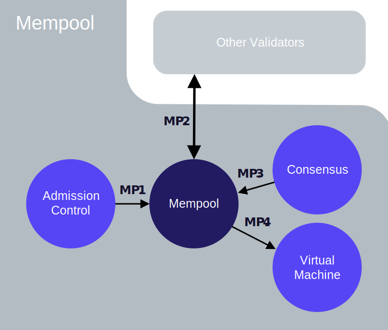
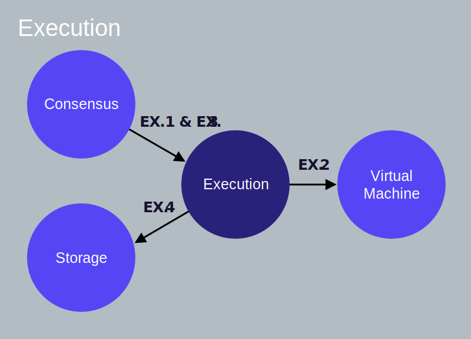

为了更深入地了解Libra交易的生命周期，我们将跟踪交易从提交到Libra验证程序到提交给Libra区块链的整个过程。 然后，我们将“放大”验证器的每个逻辑组件，并查看其与其他组件的交互。

## 客户端提交一个交易

**一个Libra客户端构建了一个原始交易** (让我们称之为 T~5~raw)，该交易从Alice的账户中转出10 Libra到Bob的账户中。其包含如下字段，每个字段都链接了它的词汇定义。

* Alice的[账户地址](reference/glossary.md#account-address).
* A program that indicates the actions to be performed on Alice's behalf. It contains:
    * A Move bytecode [peer-to-peer transaction script](reference/glossary.md#transaction-script).
    * A list of inputs to the script (for this example, Bob's account address and the amount of payment).
* [燃料价格](reference/glossary.md#gas-price) (in microlibra/gas units) &mdash; The amount Alice is willing to pay per unit of gas, to execute the transaction. Gas is a way to pay for computation and storage. A gas unit is an abstract measurement of computation with no inherent real-world value.
* Alice愿意为此交易支付的[最大燃料量](reference/glossary.md#maximum-gas-amount)。
* 交易的[超时时间](reference/glossary.md#expiration-time)。
* [序列号](reference/glossary.md#sequence-number) &mdash; 5
    * A transaction with sequence number 5 can only be applied to an account with sequence number 5.

The **client signs transaction** T~5~raw with Alice's private key. The signed transaction T~5~ includes the following:

* 原始交易。
* Alice的公钥。
* Alice的签名。

### 前提假设

为了描述交易 T~5~ 的生命周期，我们假设：

* Alice和Bob在Libra区块链上已经拥有[账户](reference/glossary.md#accounts)。
* Alice的账户中有110个Libra币。
* Alice账户当前的[交易序列号](reference/glossary.md#sequence-number)等于5(表明Alice账户中已经发送了5笔交易)。
* 总共有100个验证器 &mdash; 从V~1~到V~100~。
* 客户端将交易T~5~提交给验证器V~1~
* **验证器V~1~是本轮潜在的提议者/领导者。**

## 交易的生命周期

在本节中，我们将描述交易T~5~的生命周期，从客户端提交到最终写入到Libra区块链。

在相关的地方，并按照生命周期中的编号步骤进行操作，我们提供了指向验证器节点的相应组件间交互的链接。 熟悉交易生命周期中的所有步骤之后，您可能希望参考有关每个步骤的组件间交互的信息。

<blockquote class="block_note">
**注意：**本文档中所有图形中的箭头起源于启动交互/动作的组件，并终止于在其上执行动作的组件。 箭头**不表示**读取，写入或返回的数据。
</blockquote>

<small class="figure">Figure 1.1 交易的生命周期</small>

### 接受交易

**1** &mdash; 客户端将交易T~5~提交给验证器V~1~，由其准入控制组件(AC)处理该交易。(Client → AC [AC.1](#client-ac-ac1))

**2** &mdash; 准入控制组件(AC)将使用虚拟机（VM）组件执行合法性检查， 例如签名校验，检查Alice的帐户是否有足够的余额，确保交易T~5~未重放等。(AC → VM [AC.2](#ac-vm-ac2), [VM.1](#ac-vm-vm1))

**3** &mdash; 当T~5~通过验证检查时，准入控制组件(AC)将T~5~发送到V~1~的内存池组件。(AC → Mempool [AC.3](#ac-mempool-ac3), [MP.1](#ac-mempool-mp1))

### 与其他验证者共享交易（Sharing the Transaction With Other Validators）

**4** &mdash; 内存池组件会将T~5~保留在内存缓冲区中。 内存池组件中可能已经包含多个从Alice的地址发送的交易。

**5** &mdash; 使用共享内存池协议，V~1~将在其内存池中与其他验证器（V~2~到V~100~）共享交易（包括T~5~）。并将从其他验证器收到的交易放入其自己的内存池。(Mempool → Other Validators [MP.2](#mempool-other-validators-mp2))

### 提名区块（Proposing the Block）

**6** &mdash; 由于验证者V~1~是提议者/领导者，它将从其内存池中提取一个区块，并通过其共识组件将该块形成为提议并复制到其他验证器中。(共识 → 内存池 [MP.3](#consensus-mempool-mp3), [CO.1](#consensus-mempool-co1))

**7** &mdash; The consensus component of V~1~ is responsible for coordinating agreement among all validators on the order of transactions in the proposed block. (Consensus → Other Validators [CO.2](#consensus-other-validators-co2)). Refer to our technical paper [State Machine Replication in the Libra Blockchain](state-machine-replication-paper.md) for details of our proposed consensus protocol LibraBFT.

### 执行区块并达成共识（Executing the Block and Reaching Consensus）

**8** &mdash; As part of reaching agreement, the block of transactions (containing T~5~) is passed to the execution component. (Consensus → Execution [CO.3](#consensus-execution-consensus-other-validators-co3), [EX.1](#consensus-execution-ex1))

**9** &mdash; The execution component manages the execution of transactions in the virtual machine (VM). Note that this execution happens speculatively before the transactions in the block have been agreed upon. (Execution → VM [EX.2](#execution-vm-ex2), [VM.3](#execution-vm-vm3))

**10** &mdash; After executing the transactions in the block, the execution component appends the transactions in the block (including T~5~) to the [Merkle accumulator](#merkle-accumulators) (of the ledger history). This is an in-memory/temporary version of the Merkle accumulator. The (proposed/speculative) result of executing these transactions is returned to the consensus component. (Consensus → Execution [CO.3](#consensus-execution-consensus-other-validators-co3), [EX.1](#consensus-execution-ex1)). The arrow from "consensus" to "execution" indicates that the request to execute transactions was made by the consensus component. (For consistent use of arrows across this document, we are not using arrows to represent the flow of data).

**11** &mdash; V~1~ (the consensus leader) attempts to reach consensus on the block's execution result with other validators participating in the consensus. (Consensus → Other Validators [CO.3](#consensus-execution-consensus-other-validators-co3))

### 提交区块（Committing the Block）

**12** &mdash; If the block's execution result is agreed upon and signed by a set of validators that have the super-majority of votes, validator V~1~'s execution component reads the result of the block execution from the speculative execution cache and commits all the transactions in the block to persistent storage. (Consensus → Execution [CO.4](#consensus-execution-co4), [EX.3](#consensus-execution-ex3)), (Execution → Storage [EX.4](#execution-storage-ex4), [ST.3](#execution-storage-st3))

**13** &mdash; Alice's account will now have 100 Libra, and its sequence number will be 6. If T~5~ is replayed by Bob, it will be rejected as the sequence number of Alice's account (6) is greater than the sequence number of the replayed transaction (5).

## 验证者内部组件之间的交互（Validator Component Interactions）

在[上一节](#lifecycle-of-the-transaction)中，我们描述了从提交到写入到区块链的示例交易的典型生命周期。现在让我们更深入地了解验证器的组件间交互，因为验证器处理交易并响应查询。这些信息对以下人员最有用：

* 希望全面了解系统如何在幕后工作。
* 有兴趣最终为Libra Core项目做出贡献。

对于我们的叙述，我们假设客户端将一个交易T~N~提交给验证器V~X~。对于每个验证器组件，我们将在相应组件部分下的子部分中描述其每个组件间交互。请注意，描述组件间交互的子部分未严格按其执行顺序列出。大多数交互与交易处理相关，少数与客户端读取查询相关（查询区块链上的现有信息）。

让我们看一下验证器节点的核心逻辑组件：

* [准入控制(Admission Control)](#admission-control-ac)
* [内存池(Mempool)](#mempool)
* [共识(Consensus)](#consensus)
* [执行(Execution)](#execution)
* [虚拟机(Virtual Machine)](#virtual-machine-vm)
* [存储(Storage)](#storage)

在每个部分的末尾，我们提供了[Libra Core](libra-core-overview.md)的相应"自述"文件的链接。

## 准入控制 Admission Control (AC)

<small class="figure">Figure 1.2 准入控制</small>

准入控制组件（AC）是验证器的唯一外部接口。客户端向验证器发出的任何请求都会先转到AC。

### 客户端 → 准入控制 (AC.1)

A client submits a  transaction to the admission control of a validator V~X~. This is done via:
`AC::SubmitTransaction()`.

### 准入控制 → 虚拟机 (AC.2)

Admission control accesses the virtual machine (VM) of the validator to perform preliminary checks on the transaction in order to reject malformed transactions early. This is done via:
 [`VM::ValidateTransaction()`](#virtual-machine-b).

### 准入控制 → 内存池 (AC.3)

Once `VM::ValidateTransaction()` returns without errors, AC forwards the transaction to validator V~X~'s mempool via `Mempool::AddTransactionWithValidation().` The mempool for validator V~X~ will accept the transaction T~N~ from the AC only if the sequence number of T~N~ is greater than or equal to the current sequence number of the sender's account (note that the transaction will not be passed to consensus until it is the next sequence number).

### 准入控制 → 存储 (AC.4)

When the client performs a read query on the Libra Blockchain (for example, to get the balance of Alice's account), AC interacts with the storage component directly to obtain the requested information.

### 准入控制自述文件

有关实现细节，请参阅[准入控制组件自述](crates/admission-control.md)。

## 虚拟机组件(VM)

<small class="figure">Figure 1.3 虚拟机组件</small>

[Move virtual machine](move-overview.md) (VM)验证并执行以Move字节码编码的交易脚本。

### 准入控制 → 虚拟机 (VM.1)

When admission control of validator V~X~ receives a transaction from a client, it invokes `VM::ValidateTransaction()` on the VM to validate the transaction.

### 虚拟机 → 存储 (VM.2)

当准入控制组件或内存池组件请求虚拟机组件通过 `VM::ValidateTransaction()` 验证交易时，虚拟机组件从存储组件加载交易发送者的帐户并执行以下验证：

* 检查交易上的输入签名是否正确（以拒绝错误签名的交易）。
* Checks that the sender's account authentication key is the same as the hash of the public key (corresponding to the private key used to sign the transaction).
* Verifies that the sequence number for the transaction is not less than the current sequence number for the sender's account.  Doing this check prevents the replay of the same transaction against the sender's account.
* Verifies that the program in the signed transaction is not malformed, as a malformed program cannot be executed by the VM.
* Verifies that there is sufficient balance in the sender's account to support the max gas amount specified in the transaction, which ensures that the transaction can pay for the resources it uses.

### 执行 → 虚拟机 (VM.3)

执行组件利用虚拟机组件通过 `VM::ExecuteTransaction()` 执行交易。

It is important to understand that executing a transaction is different from updating the state of the ledger and persisting the results in storage. A transaction T~N~ is first executed as part of an attempt to reach agreement on blocks during consensus. If agreement is reached with the other validators on the ordering of transactions and their execution results, the results are persisted in storage and the state of the ledger is updated.

### 内存池 → 虚拟机 (VM.4)

When mempool receives a transaction from other validators via shared mempool, mempool invokes [`VM::ValidateTransaction()`](#action-b-1) on the VM to validate the transaction.

### 虚拟机组件自述

有关实现的详细信息，请参阅[虚拟机组件自述](crates/vm.md)。

## 内存池组件

<small class="figure">Figure 1.4 内存池</small>

内存池是一个共享缓冲区，用于保存“等待”执行的交易。当新交易添加到内存池时，内存池与系统中的其他验证器共享此交易。为了减少“共享内存池”中的网络消耗，每个验证器负责将其自己的交易传递给其他验证器。当验证器从另一个验证器的内存池接收到一个交易时，该交易将被添加到收件人验证器的内存池中。
Mempool is a shared buffer that holds the transactions that are “waiting” to be executed. When a new transaction is added to the mempool, the mempool shares this transaction with other validators in the system. To reduce network consumption in the “shared mempool,” each validator is responsible for delivering its own transactions to other validators. When a validator receives a transaction from the mempool of another validator, the transaction is added to the mempool of the recipient validator.

### 准入控制 → 内存池 (MP.1)

* After performing initial validation checks, a validator's AC sends the transaction to the validator’s mempool.
* The mempool for validator V~X~ accepts transaction T~N~ for the sender's account only if the sequence number of T~N~ is greater than or equal to the current sequence number of the sender's account.

### 内存池 → 其他验证器 (MP.2)

* The mempool of validator V~X~ shares transaction T~N~ with the other validators on the same network.
* Other validators share the transactions in their mempool with V~X~’s mempool.

### 共识 → 内存池 (MP.3)

* When validator V~X~ becomes the leader, its consensus will pull a block of transactions from its mempool and replicate the block to other validators. It does this to arrive at a consensus on the ordering of transactions and the execution results of the transactions in the block.
* Note that just because a transaction T~N~ was included in a consensus block, it does not guarantee that T~N~ will eventually be persisted in the distributed database of the blockchain.

### 内存池 → 虚拟机 (MP.4)

When mempool receives a transaction from other validators, mempool invokes [`VM::ValidateTransaction()`](#action-b-1) on the VM to validate the transaction.

### 内存池组件自述

有关实现的详细信息，请参阅[内存池组件自述](crates/mempool)。

## 共识组件(Consensus)

<small class="figure">Figure 1.5 Consensus</small>

共识组件负责对区块中的交易进行排序，并通过与网络中的其他验证器一起参与[共识协议](#consensus-protocol)来商定执行结果。

### 共识 → 内存池 (CO.1)

当验证器V~X~是潜在的领导者/提议者时，V~X~的共识从其内存池通过：`Mempool::GetBlock()` 获取一个区块，并形成一个提议。

### 共识 → 其他验证者 (CO.2)

如果V~X~是提议者/领导者，则其共识组件将提议的区块复制给其他验证器。

### 共识 → 执行, 共识 → 其他验证器 (CO.3)

* 为了执行一个区块，共识组件与执行组件交互。 共识组件通过`Execution:ExecuteBlock()`执行一个区块(参见[Consensus → Execution](#consensus-execution-ex1))。
* 执行区块中的交易后，执行组件将执行这些交易的结果返回给共识组件。
* 共识组件签署执行结果，并试图与参与共识协商的其他验证器就结果达成一致。

### 共识 → 执行 (CO.4)

如果足够多的验证器为相同的执行结果投票，则V~X~的共识组件通过`Execution::CommitBlock()`通知执行该块已准备好提交。

### 共识组件自述

有关实现细节，请参阅[共识组件自述](crates/consensus.md)。

## 执行组件(Execution) 

<small class="figure">Figure 1.6 Execution</small>

Execution's job is to coordinate the execution of a block of transactions and maintain a transient state that can be voted upon by consensus.

### 共识 → 执行 (EX.1)

*  Consensus requests execution to execute a block of transactions via: `Execution::ExecuteBlock()`.
* Execution maintains a “scratchpad,” which holds in-memory copies of the relevant portions of the [Merkle accumulators](#merkle-accumulators). This information is used to calculate the root hash of the current state of the blockchain.
* The root hash of the current state is combined with the information about the transactions in the block to determine the new root hash of the accumulator. This is done prior to persisting any data, and to ensure that no state or transaction is stored until agreement is reached by a quorum of validators.
* Execution computes the speculative root hash and then consensus of V~X~ signs this root hash and attempts to reach agreement on this root hash with other validators.

### 执行 → 虚拟机 (EX.2)

当共识组件请求执行组件通过`Execution::ExecuteBlock()`执行一个区块时，执行组件使用VM组件来确定执行区块的结果。

### 共识 → 执行 (EX.3)

如果法定数量的验证器同意区块执行结果，则每个验证器的共识组件通过`Execution::CommitBlock()`通知其执行组件该块已准备好提交。对执行组件的此调用将包括所有同意验证器的签名，以提供其协议的证明。

### 执行 → 存储 (EX.4)

执行组件从其“暂存器”获取值，并通过`Storage::SaveTransactions()`将它们发送到存储器以进行持久化。执行组件然后把不再需要的“暂存器”中的旧值删除（例如，无法提交的并行区块）。

### 执行组件自述

有关实现的详细信息，请参阅[执行组件自述](crates/execution)。

## 存储组件

<small class="figure">Figure 1.7 Storage</small>

存储组件持久化保存已经达成共识的交易块及其执行结果。在下列情况下，将通过存储保存一批或一组交易(包括交易 T~N~ )：

* 超过 2f+1 的验证人就以下所有方面达成一致达成共识：
    * 哪些交易会被包含在块中。
    * 交易的先后顺序。
    * 包含在块中的全部交易的执行结果。

有关如何将交易附加到表示区块链的数据结构的信息，请参阅[Merkle accumulators](reference/glossary.md#merkle-accumulators)。

### 虚拟机 → 存储 (ST.1)

当准入控制组件或内存池组件调用`VM::ValidateTransaction()`来验证交易时，`VM::ValidateTransaction()`从存储组件加载发送人的帐户并对交易执行只读有效性检查。

### 执行 → 存储 (ST.2)

当共识组件调用`Execution::ExecuteBlock()`时，执行组件从存储组件中读取结合了内存中的“暂存器”数据的当前状态来确定执行结果。

### 执行 → 存储 (ST.3)

* 一旦一个区块中的交易达成了共识，执行组件就会通过`Storage::SaveTransactions()`调用存储组件来保存区块并永久存储它们。同时还将存储来自同意此区块的验证器节点的签名。
* 此块的“暂存器”中的内存数据将传递到更新后的存储组件并持久化这些交易。
* 更新存储组件时，每个交易修改的所有资源的序列号都会相应更新。
* 注意：对于源自该帐户的每个已提交交易，Libra区块链上的帐户序列号递增1。

### 准入控制 → 存储 (ST.4)

对于从区块链读取信息的客户端查询请求，准入控制组件直接与存储组件交互以读取所请求的信息。

### 存储组件自述

有关实现的详细信息，请参阅[存储组件自述](crates/storage.md)。

## 参考资料

* [欢迎页](welcome-to-libra.md).
* [Libra协议: 核心概念](libra-protocol.md) &mdash; 介绍Libra协议的基础概念。
* [我的第一笔交易](my-first-transaction.md) &mdash; 指导您使用Libra命令行客户端在Libra上执行您的第一笔交易。
* [Move入门](move-overview.md) &mdash; 向您介绍一种称为Move的新区块链编程语言。
* [Libra核心概览](libra-core-overview.md) &mdash; 通过README文件提供Libra核心组件的概念和实现细节。
* [命令行指导](reference/libra-cli.md) &mdash; 列出Libra客户端的命令（及其用法）。
* [Libra术语表](reference/glossary.md) &mdash; 提供Libra术语的快速参考。
* [Libra区块链的复制状态机](state-machine-replication-paper.md) &mdash; 详细介绍了Libra的共识协议**LibraBFT**。

